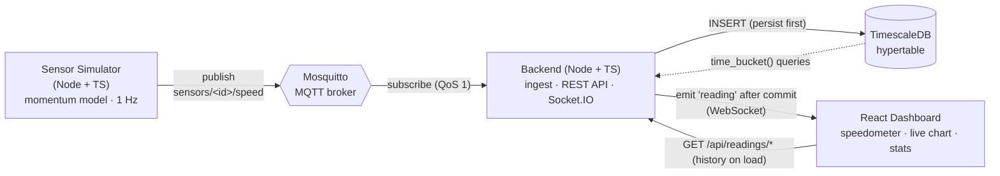

# Real-Time Speedometer

A small but production-shaped IoT telemetry pipeline. A simulated speed sensor
emits a reading **every second**; the readings travel over **MQTT**, are
persisted to a **TimescaleDB** time-series database, and are pushed live to a
**React** dashboard where a **speedometer gauge updates in real time** as each
sample lands in the database.

> Stack: **Node.js + TypeScript · MQTT (Mosquitto) · PostgreSQL/TimescaleDB · React + Vite, docker**.

---

## Architecture




```
 ┌──────────────────┐   MQTT publish    ┌──────────────┐   MQTT subscribe   ┌──────────────────────────┐
 │ Sensor Simulator │  sensors/<id>/    │  Mosquitto   │   sensors/+/speed  │        Backend           │
 │   Node + TS      │ ───── speed ─────▶│ MQTT broker  │ ──────────────────▶│  • validate (Zod)        │
 │ momentum @ 1 Hz  │     (1 Hz)        │ :1883/:9001  │                    │  • INSERT → TimescaleDB  │
 └──────────────────┘                   └──────────────┘                    │  • emit Socket.IO        │
                                                                            │  • REST history API      │
                                                                            └──────┬─────────┬─────────┘
                                                            INSERT (persist) │         │ emit after commit
                                                                             ▼         ▼  (WebSocket)
                                                                    ┌──────────────┐  ┌──────────────────┐
                                                                    │ TimescaleDB  │  │  React Dashboard  │
                                                                    │  hypertable  │  │  speedometer +    │
                                                                    │  time_bucket │  │  chart + stats    │
                                                                    └──────────────┘  └──────────────────┘
```


- **MQTT** is the standard IoT transport — lightweight pub/sub with QoS that
  decouples sensors from consumers.
- **TimescaleDB** is PostgreSQL with time-series support
  (hypertables, `time_bucket()`), keeping full SQL while getting efficient
  time-partitioned storage.
- The backend **persists each sample first, then broadcasts the stored row**, so
  the gauge always reflects exactly what is in the database 
- **Socket.IO** gives the browser a resilient WebSocket (auto-reconnect,
  connection-state recovery, HTTP long-poll fallback).


---

## Quick start

**Prerequisites:** Docker Engine + Docker Compose v2 

```bash
# from the repository root
docker compose up --build
```

Then open **<http://localhost:8080>**. 

That single command starts five services in the correct order (database and
broker first, then the backend once they're healthy, then the simulator and the
web UI):

| Service       | Image / build       | Host port  | Purpose                          |
| ------------- | ------------------- | ---------- | -------------------------------- |
| `timescaledb` | timescale/…pg17     | 5432       | Time-series storage (hypertable) |
| `mqtt`        | eclipse-mosquitto:2 | 1883/9001  | MQTT broker                      |
| `backend`     | ./backend           | (internal) | Ingest + REST API + Socket.IO    |
| `simulator`   | ./simulator         | —          | Publishes speed samples at 1 Hz  |
| `frontend`    | ./frontend (nginx)  | 8080       | React dashboard + reverse proxy  |

Stop and remove everything (including stored data):

```bash
docker compose down -v
```

---

## Local development (without Docker)

You need Node.js 22+, plus a reachable MQTT broker and a TimescaleDB/PostgreSQL
instance. The easiest path is to run just those two in Docker and run the apps
on the host:

```bash
# 1. infra only
docker compose up -d mqtt timescaledb

# 2. backend (terminal A)
cd backend && cp .env.example .env && npm install && npm run dev

# 3. simulator (terminal B)
cd simulator && cp .env.example .env && npm install && npm run dev

# 4. frontend (terminal C)
cd frontend && npm install && npm run dev   # http://localhost:5173
```

The Vite dev server proxies `/api` and `/socket.io` to the backend on
`localhost:3001`, so the frontend always uses same-origin relative URLs.

---

## Project structure

```
unbox-assignment/
├── docker-compose.yml         # orchestrates all 5 services
├── .env.example               # root config (compose reads this)
├── db/init/01-init.sql        # TimescaleDB extension + hypertable + index
├── infra/mosquitto/config/    # Mosquitto broker config
├── backend/                   # ingest + REST API + Socket.IO (Node + TS)
│   └── src/
│       ├── config/            # env validation (Zod) + Pino logger
│       ├── domain/            # the MQTT/DB/WS data contract
│       ├── db/                # pool, idempotent schema, repository (all SQL)
│       ├── mqtt/              # broker subscriber
│       ├── ingest/            # parse → validate → persist → broadcast
│       ├── realtime/          # Socket.IO server
│       ├── api/               # Express app + readings routes
│       └── index.ts           # bootstrap + graceful shutdown
├── simulator/                 # speed sensor (Node + TS)
│   └── src/
│       ├── speed-model.ts     # realistic momentum-based speed generator
│       └── index.ts           # MQTT publisher loop
├── frontend/                  # React + Vite dashboard
│   └── src/
│       ├── hooks/useSpeedStream.ts   # Socket.IO + history seeding
│       └── components/        # Speedometer, SpeedChart, StatsPanel, badge
└── docs/                      # ARCHITECTURE.md + ASSIGNMENT.md
```

---

## REST API

The live feed is over Socket.IO; these endpoints serve history and aggregates.
All are reachable through the frontend origin (e.g. `http://localhost:8080`).

| Method & path                                      | Description                                   |
| -------------------------------------------------- | --------------------------------------------- |
| `GET /api/health`                                  | Liveness + DB readiness probe                 |
| `GET /api/readings/recent?deviceId&limit`          | Most recent raw samples (oldest → newest)     |
| `GET /api/readings/stats?deviceId&window`          | count / current / avg / min / max over window |
| `GET /api/readings/history?deviceId&window&bucket` | `time_bucket()`-downsampled avg/max series    |

```bash
curl "http://localhost:8080/api/readings/recent?limit=5"
curl "http://localhost:8080/api/readings/history?window=60&bucket=5"
```

---

## Configuration

Every value has a working default baked into `docker-compose.yml`, so the stack
boots with no `.env`. To customise, copy `.env.example` to `.env`. Key knobs:

| Variable          | Default      | Effect                               |
| ----------------- | ------------ | ------------------------------------ |
| `SIM_INTERVAL_MS` | `1000`       | Sampling interval (assignment: 1 s)  |
| `SIM_MAX_SPEED`   | `220`        | Simulated + dial maximum (km/h)      |
| `SIM_DEVICE_ID`   | `vehicle-01` | Sensor id (topic + dashboard filter) |
| `FRONTEND_PORT`   | `8080`       | Where the dashboard is published     |
| `LOG_LEVEL`       | `info`       | Pino log level                       |

---

## How "real-time as data is inserted" works

1. The simulator publishes `{ deviceId, speed, ts }` to `sensors/<id>/speed`.
2. The backend's MQTT subscriber receives it, validates the payload with Zod,
   and **`INSERT`s it into the `speed_readings` hypertable**.
3. **Only after the insert returns** does the backend `emit('reading', row)` to
   all connected Socket.IO clients — so the broadcast carries the persisted row.
4. The React hook receives the event and updates the speedometer needle (smooth
   ~1 s animation), the live chart, and the statistics.

On first load the dashboard also fetches recent history so the chart isn't empty.

---

## Tech stack & tooling

- **Backend:** Node 22, TypeScript (strict, ESM/NodeNext), Express 5, Socket.IO,
  `mqtt`, `pg`, Zod, Pino.
- **Simulator:** Node 22, TypeScript, `mqtt`, Zod, Pino.
- **Frontend:** React 19, Vite, TypeScript, `react-d3-speedometer`, Recharts,
  `socket.io-client`.
- **Data / infra:** TimescaleDB (PostgreSQL 17), Eclipse Mosquitto 2, nginx.
- **Quality:** ESLint (flat config) + Prettier, strict TypeScript, multi-stage
  Docker builds running as non-root, healthchecks, and graceful shutdown.
